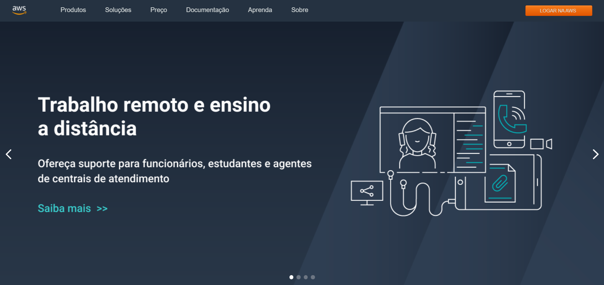

# Hiring Coders - Fase 3, Squad 05

Este é o repositório do grupo 5, ficamos com o desafio de desenvolver uma loja
com o style guide da Amazon Web Services (AWS).

Desenvolvemos uma página sobre, mostrar as virtudes do serviços
da AWS e uma listagem de produtos cadastrados.

Utilizamos o [minimum boiler template](https://github.com/vtex-apps/minimum-boilerplate-theme) como base para o desenvolvimento, também criamos um componente React para a captura dos leads.

Para testar

> git clone https://github.com/HC-group5-aws/front-end-loja/tree/

> vtex login account_name

> vtex use workspace name

> vtex link

### Tecnologias

  
   
   

   

